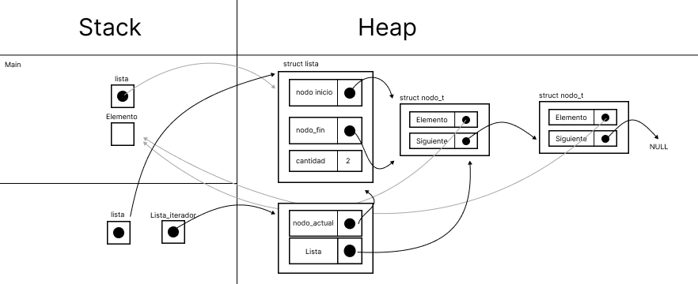

<div align="right">

</div>

# NOMBRE TP/TDA

## Repositorio de (Eduardo González) - (110006) - (eegonzalez@fi.uba.ar)

- Para compilar:

```bash
make pruebas_chanutron
```

- Para ejecutar:

```bash
./pruebas_chanutron
```

- Para ejecutar con valgrind:
```bash
make valgrind-chanutron
```
---

<h1>Definiciones</h1>

<div align="center">

</div>

Este tipo de dato está basado en los nodos enlazados, la idea es que cada nodo pueda conocer al nodo siguiente para poder formar una lista de nodos. Se alcanza el final de la lista cuando el último nodo apunta a NULL. 

Entre las primitivas se encuentra el crear una lista inicializando la estructura con campos válidos, insertar un elemento al final de la lista, insertar en una posición deseada, borrar el último elemento de la lista, borrar un elemento en determinada posicion, devolver el elemento en la posición indicada, devolver el primer elemento de la lista, devolver el ultimo elemento de la lista, indicar si una lista se encuentra vacia o no, devolver el tamaño de la lista y por último, destruir la lista que consiste en liberar toda la memoria que haya sido reservada.  

<div align="center">

</div>

Este tipo de dato puede definirse como una colección ordenada de elementos en el que se pueden insertar o eliminar elementos por un extremo llamado tope. Para la implementación de este TDA usando lista de nodos enlazados, se podrá ver que se insertan o eliminan nodos al inicio de la lista, donde dicho inicio actúa como tope de la pila. 

Entre sus operaciones básicas se encuentra el crear la pila, insertar elementos (push), eliminar elementos (pop), devolver el tamaño de la pila, indicar si una pila está vacía o no y destruir la pila que consiste en liberar toda la memoria almacenada. 

<div align="center">

</div>

Otro tipo de TDA es el tipo de dato cola, este tipo de dato se diferencia del de pila por el simple hecho de contar con dos extremos. Uno de ellos es el frente y otro el final. El primer elemento insertado se encontrará en el frente y el que le antecede representará el final. 

Por cada elemento que se agregue, dicho final irá cambiando. De la misma forma sucede con eliminar o desencolar un elemento, esta operación se tiene que hacer desde el frente, cambiando el extremo frente por cada elemento desencolado. 

Entre sus operaciones básicas se encuentra el crear la cola, encolar, desencolar, obtener el primer elemento de la cola, indicar si está o no vacía la cola y destruir o liberar la memoria almacenada por la cola. 

<h1>Funcionamiento TDA Lista</h1>

A continuación hay una breve explicación de como funcionan algunas operaciones básicas del TDA lista usando diagramas de memoria: 

## Creación de la lista:

Para la creación de la lista se reserva memoria en el Heap y como mencionamos anteriormente, inicializamos los campos de nuestra estructura con valores válidos, en este caso hacemos que el nodo_inicio y nodo_fin apunten a NULL debido a que no hay más elementos presentes en la lista. De igual forma la cantidad de elementos la inicializamos en cero.

<div align="center">

</div>

## Inserción al final:

Como vimos anteriormente nuestra lista se encuentra vacia. Para insertar nuevos elementos podemos invocar a nuestra función de lista_insertar que reserva memoria para un nuevo nodo en el heap, haciendo que el elemento que contiene el nuevo nodo apunte al elemento que deseo insertar y que el campo siguiente apunte a NULL. A su vez, el nodo_inicio apunta al nuevo nodo por ser el primero y el nodo_fin apunta al nuevo_nodo por ser el único y último elemento. 

<div align="center">

</div>

Al terminar de ejecutarse nuestra función, el elemento que queríamos insertar ya se encuentra en la lista y la cantidad de elementos que posee la lista aumenta a uno. 

<div align="center">

</div>

## Eliminar al final:

Luego tenemos operaciones que eliminan elementos al final de la lista, para estos casos llamos a lista_quitar que recibe un puntero a la lista

<div align="center">

</div>

Seguido de esto nos encargamos de buscar el nodo que se encuentre en la última posición de la lista y apuntamos a él para liberarlo. También hacemos que el nodo_inicial y nodo_final apunten a NULL ya que solo había un elemento presente en la lista. 

<div align="center">

</div>


Al terminar de ejecutarse la función, se ha eliminado el nodo que se encontraba en la última posición y ahora la cantidad de elementos que posee la lista es cero.

<div align="center">

</div>

## Destruir la lista:

Una de las últimas funciones a explicar es la función lista_destruir, el cual tiene dos punteros que apuntan a un nodo_actual y a un nodo_siguiente. Primero se libera el nodo_siguiente y después hacemos que el nodo_actual apunte a NULL. 

<div align="center">

</div>

Debido a que solo hay dos elementos en la lista, no tiene sentido determinar un nuevo nodo_actual y un nuevo nodo_siguiente, por lo que el actual sigue apuntando al mismo lugar y el siguiente a NULL. Luego liberamos la memoria del nodo_actual.

<div align="center">

</div>

Por ultimo, ya que no quedan más elementos en la lista, liberamos la memoria de la lista. 

<div align="center">

</div>

El resultado de ejecutar la función lista_destruir es que libera toda la memoria almacenada por la lista y los elementos que contiene. 

<div align="center">

</div>

<h1>Funcionamiento iterador externo</h1>

el iterador externo es un TDA que contiene operaciones básicas para recorrer otro TDA, entre sus funciones está el crear, devolver el primer elemento, devolver el siguiente, indicar si hay o no un siguiente, devolver el elemento actual y destruir iterador. 

<div align="center">

</div>

Cuando creamos un iterador, reservamos memoria en el heap y hacemos que dicho iterador apunte a la lista y al primer nodo de la lista. En caso de querer avanzar, solo haria falta cambiar el puntero. 

<div align="center">

</div>

Este proceso se haría en repetidas ocasiones hasta llegar al final de la lista y es esto lo que nos permite realizar la mayoria de las operaciones básicas del iterador en tiempo constante. 

<h1>Análisis de complejidad</h1>

A continuación, podemos visualizar las diferencias de complejidad entre las implementaciones de la lista simplemente enlazada, doblemente enlazada y el vector dinámico para las operaciones de insertar, obtener y eliminar:

<div align="center">

</div>

En base a esto podemos analizar la complejidad al hacer push/pop en una pila o de encolar/desencolar en tiempo constante. 

Para el caso de apilar, esta operación se hace en tiempo constante ya que se inserta en el nodo inicio e insertar acá es O(n).
Por lo tanto el nodo inicio es el tope de esta pila. 

```c
pila_t *pila_apilar(pila_t *pila, void *elemento)
{
	return (pila_t *)lista_insertar_en_posicion((lista_t *)pila, elemento,
						    0);
}
```

Para el caso de desapilar sucede lo mismo. Desapilamos en el inicio y esta operación también es O(n). 

```c
void *pila_desapilar(pila_t *pila)
{
	return lista_quitar_de_posicion((lista_t *)pila, 0);
}
```

Para el TDA cola se decició elegir el nodo final como "frente" y el nodo inicio como "final" de la cola. Es por esto que encolar 
es O(1) ya que la inserción se hace al final en tiempo constante

```c
cola_t *cola_encolar(cola_t *cola, void *elemento)
{
	return (cola_t *)lista_insertar((lista_t *)cola, elemento);
}
```

En el caso de desencolar, se elimina al inicio y es por eso que esta operación es en tiempo constante O(1).

```c
void *cola_desencolar(cola_t *cola)
{
	return lista_quitar_de_posicion((lista_t *)cola, 0);
}
```

Con respecto al resto de las operaciones, tanto para cola como para pila, todas las operaciones son O(1) a excepción de cola_destruir y 
pila_destruir. 